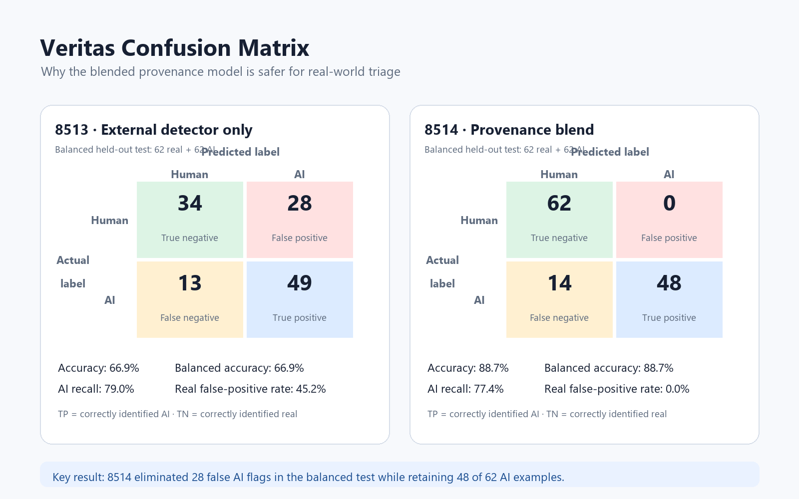

# Veritas

Veritas is an explainable media-triage prototype that combines a pretrained
ConvNeXt visual detector with Benford leading-digit drift and claimed camera
metadata evidence. It reports a six-tier assessment rather than presenting
the result as proof of an image's origin.

## What it does

- Accepts PNG, JPG/JPEG, HEIC, and HEIF image uploads.
- Uses a pretrained visual detector as the primary signal.
- Adds small, explainable adjustments from Benford MAD and EXIF camera metadata.
- Displays the evidence behind the final assessment.

## Run locally

```powershell
python -m pip install -r requirements.txt
streamlit run app_provenance_blend.py
```

The external model checkpoint is intentionally not included in this repository
because it is approximately 1 GB. When the local checkpoint is present, the
app uses it from:

```text
external_models/xrayon/AI Images Detector/checkpoints/checkpoint_phase2.pth
```

When that file is absent, the app downloads it automatically from the official
public [xRayon ConvNeXt AI Images Detector model repository](https://huggingface.co/xRayon/convnext-ai-images-detector)
and caches it for the running environment. The model repository identifies the
checkpoint as MIT-licensed; retain that attribution when redistributing the
prototype. The first cloud scan can take longer because the checkpoint is
approximately 1 GB.

## Important limitation

Veritas is an evidence-based triage assistant. Its assessments are not
calibrated probabilities and do not prove whether an image is AI-generated or
human-made. EXIF metadata can be missing, edited, or copied.

## Benchmark snapshot

On a balanced held-out set of 62 real camera images and 62 confirmed AI images,
the provenance-blend policy reached 88.7% balanced accuracy, with 77.4% AI
recall and 0.0% real-image false-positive rate. This is a prototype benchmark,
not a claim of universal performance.

The benchmark graphic below compares the external-only detector with the
provenance blend using clearly separated predicted-label headings.



[Open the full-size confusion matrix](./confusion_matrix_comparison.png)
